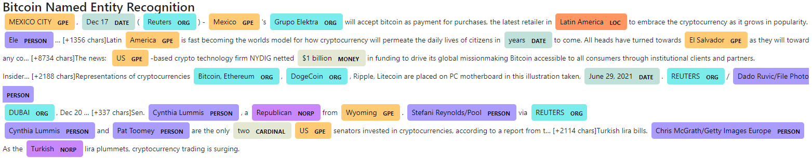

# Crypto_Sentiment_Analysis
Sentiment Analysis Using NLP for the latest Bitcoin and Ethereum News. The 100 latest English news articles since December 17, 2021 were pulled using NewsAPI.

 

## Sentiment Analysis

Based on the review of the sentiment in the latest news articles, the following conclusions were made:

1. Ethereum had the higher positive score on average (0.088) than Bitcoin (0.071) for the latest news articles.

2. Ethereum also had not only the higher compound score (0.268) on average than Bitcoin (0.147), but Ethereum also had the highest overall compound score (0.906) for the latest articles.

3. Finally, Ethereum had the highest overall positive sentiment score (0.395) as opposed to Bitcoin (0.291).

 

---

 

## Natural Language Processing

After tokenizing the news articles, the top 10 n-grams for (n=2) were identified as follows, with the number of times the n-grams are present in parentheses:

**Bitcoin Top 10 N-Grams**  
1. trading, session (10)
2. latest, trading (9)
3. marking, move (9)
4. per, share(9)
5. us, dollar (8)
6. narrower, sampp (7)
7. charsin, latest (6)
8. closed, marking (6)
9. move, previous (6)
10. sampp, daily (6)

**Ethereum Top 10 N-Grams**  
1. cryptocurrency, market (7)
2. crypto, market (6)
3. jack, dorsey (5)
4. bitcoin, ethereum (3)
5. nonfungible, token (3)
6. past, year (3)
7. cryptocurrency, investor (3)
8. aggregate, value (3)
9. value, digital (3)
10. cryptocurrency, community (3)

The top 10 words for Bitcoin and Ethereum are as follows, with the number of times the words are present in parentheses:

**Bitcoin Top 10 Words**  
1. dollar (20)
2. stock (18)
3. share (17)
4. trading (16)
5. loss (15)
6. year (14)
7. move (14)
8. market (14)
9. bitcoin (13)
10. us (13)

**Ethereum Top 10 Words**  
1. cryptocurrency (27)
2. year (22)
3. market (21)
4. cryptocurrencies (19)
5. crypto (18)
6. ethereum (16)
7. bitcoin (14)
8. token (12)
9. blockchain (11)
10. trading (11)

Based on these top words for each coin, word clouds were generated for each coin, as shown below. 

**Bitcoin Word Cloud** 

**Ethereum Word Cloud** 

 

---

 

## Named Entity Recognition

A Named Entity Recognition (NER) analysis using SpaCy was performed for the articles of both coins. A snippet of the visualization generated for the Bitcoin articles is shown below. 

The full list of entities and their corresponding labels was output for viewing in the Jupyter Notebook code, but it is not included here.